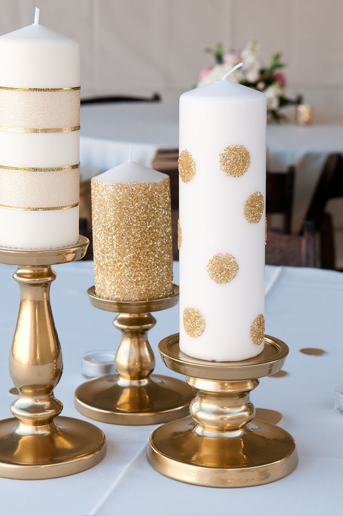
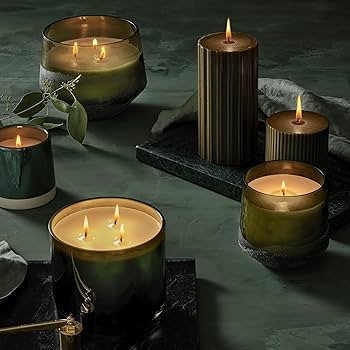

# Documentación del Proyecto VelAromatic

Este proyecto es una página web para una tienda de velas aromáticas llamada **VelAromatic**. A continuación, se explica la estructura semántica del código HTML y se justifica el uso de las etiquetas.

---

## Estructura Semántica

### 1. **`<header>`**
   - **Uso:** Contiene el menú de navegación principal.
   - **Justificación:** El `<header>` es el lugar adecuado para incluir el logo y la navegación principal. Se usa `<nav>` para definir la barra de navegación y se añade `aria-label="Menú principal"` para mejorar la accesibilidad.

### 2. **`<main>`**
   - **Uso:** Contiene el contenido principal de la página.
   - **Justificación:** El `<main>` agrupa todo el contenido principal, como la sección de héroe, características, envíos y pagos. Esto ayuda a los motores de búsqueda y a los lectores de pantalla a identificar el contenido central.

### 3. **`<section>`**
   - **Uso:** Divide el contenido en secciones temáticas.
   - **Justificación:** Cada sección (`#hero`, `#caracteristicas`, `#envios`, `#pagos`) tiene un propósito específico. Se usa `aria-labelledby` para asociar el título de la sección con su contenido, mejorando la accesibilidad.

### 4. **`<footer>`**
   - **Uso:** Contiene información de contacto, enlaces importantes y redes sociales.
   - **Justificación:** El `<footer>` es el lugar adecuado para información adicional y enlaces secundarios. Se usa `<address>` para la información de contacto, lo que es semánticamente correcto.

### 5. **Etiquetas de Accesibilidad**
   - **Uso:** `aria-label`, `aria-labelledby`, `aria-current`.
   - **Justificación:** Estas etiquetas mejoran la accesibilidad para usuarios con discapacidades visuales, permitiendo que los lectores de pantalla describan mejor los elementos.

### 6. **`<ul>` y `<li>`**
   - **Uso:** Para listas de elementos (menú, características, opciones de envío, etc.).
   - **Justificación:** Las listas son la forma correcta de estructurar elementos relacionados, como opciones de menú o características de productos.

### 7. **``**
   - **Uso:** Para mostrar imágenes relacionadas con las características de las velas.
   - **Justificación:** Cada imagen incluye un atributo `alt` que describe su contenido, lo que es esencial para la accesibilidad y el SEO.

### 8. **`<button>`**
   - **Uso:** Para el botón de cambio de tema (modo claro/oscuro).
   - **Justificación:** El botón es interactivo y cambia el tema de la página. Se usa `aria-label` para describir su función.

### 9. **`<script>`**
   - **Uso:** Para implementar el cambio de tema (modo claro/oscuro).
   - **Justificación:** El script permite a los usuarios cambiar el tema y guarda su preferencia en `localStorage`.

---

## Justificación de Etiquetas Semánticas

- **`<header>` y `<footer>`:** Definen claramente el inicio y el final de la página, mejorando la estructura y la accesibilidad.
- **`<main>` y `<section>`:** Organizan el contenido de manera lógica y semántica, facilitando la navegación y el SEO.
- **`<nav>`:** Identifica la navegación principal y secundaria, lo que es útil para usuarios y motores de búsqueda.
- **`<address>`:** Específico para información de contacto, lo que es semánticamente correcto.
- **`<ul>` y `<li>`:** Estructuran listas de manera clara y accesible.
- **Atributos ARIA:** Mejoran la accesibilidad para usuarios con discapacidades.

---

## Conclusión

La estructura semántica del código HTML sigue las mejores prácticas de accesibilidad y SEO. El uso de etiquetas como `<header>`, `<main>`, `<section>`, y `<footer>` organiza el contenido de manera clara, mientras que los atributos ARIA mejoran la experiencia para usuarios con discapacidades. Además, el código es fácil de mantener y escalar.

---

## 🟢 Break Points

Se modificó el diseño **`responsive`** para mejorar la vista en pantallas pequeñas, donde el **`header`** cambia a una posición vertical.

### 📜 Código CSS

```css
/* Responsive */
@media (max-width: 768px) {
  
  nav {
    flex-direction: column;
    padding: 0.5rem;
  }

  .logo {
    width: 100%;
    text-align: center;
    padding: 0.5rem;
  }

  nav ul {
    display: flex; 
    flex-direction: column;
    width: 100%;
    gap: 0;
    margin-top: 1rem;
  }

  nav ul li {
    width: 100%;
    text-align: center;
    border-top: 1px solid var(--border-color);
  }

  nav ul li a {
    display: block;
    padding: 0.8rem;
  }

  #theme-toggle {
    position: absolute;
    top: 1rem;
    right: 1rem;
  }

  #hero {
    height: 300px;
    /* Se agregó esta parte */
    margin-top: var(--header-height-mobile);
  }
  
  #hero h1 {
    font-size: 2rem;
  }
  
  main section {
    padding: 1rem;
  }
}

/* Estilos para mejorar la interacción en móviles */
@media (max-width: 768px) {
  nav ul li:hover {
    background-color: var(--nav-bg);
  }

  nav ul li a:hover {
    color: var(--primary-color);
  }

  /* Para que el header no ocupe demasiado espacio */
  header {
    max-height: 100vh;
    overflow-y: auto;
  }
}
```
---

### 🆕 Nuevo Botón y Sección de Galería

Se agregó un nuevo **`botón`** en el menú de navegación y un nuevo **`section`** para la galería de imágenes.

### 🌐 Código HTML del Botón en el Menú

```html
<li><a href="#envios">Envíos</a></li>
<li><a href="#pagos">Pagos</a></li>
<!-- Se agrega aquí el nuevo botón de galería -->
<li><a href="#galeria">Galería</a></li>
<li><a href="#contacto">Contacto</a></li>
```

### 🖼️ Código HTML de la Nueva Sección de Galería

```html
<!-- Nueva Sección de Galería -->
<section id="galeria" aria-labelledby="galeria-heading">
  <h2 id="galeria-heading">Galería de Imágenes</h2>
  <article
    class="galeria-grid"
    aria-label="Colección de velas aromáticas"
  >
    <figure>
      
      <figcaption>Vela de Lavanda</figcaption>
    </figure>

    <figure>
      
      <figcaption>Vela con Decoración</figcaption>
    </figure>

    <figure>
      
      <figcaption>Colección Cítrica</figcaption>
    </figure>

    <figure>
      
      <figcaption>Vela de Canela</figcaption>
    </figure>

    <figure>
      
      <figcaption>Vela con Dorados</figcaption>
    </figure>

    <figure>
      
      <figcaption>Vela Elegante</figcaption>
    </figure>
  </article>
</section>

```
---
### 🎨 Estilo Responsive para la Galería  

Se agregó en el archivo CSS el estilo **`@media`** para adaptar la galería a dispositivos móviles y pantallas pequeñas.  

#### 📜 Código CSS  

```css
/* Agregar aquí los nuevos media */
@media (max-width: 768px) {
  .galeria-grid {
    grid-template-columns: repeat(2, 1fr);
    gap: 1rem;
  }

  .galeria-grid img {
    height: 200px;
  }
}

@media (max-width: 480px) {
  .galeria-grid {
    grid-template-columns: 1fr;
  }
}
```
